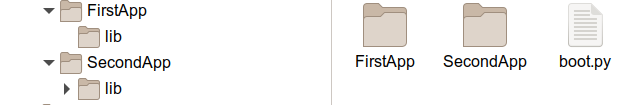

Bootswitcher for CircuitPython
==============================

This repository provides a `boot.py` file that lets you switch between
two CircuitPython applications on single device without the need to
install them again.

There are a few use-cases for this kind of setup:

  - running and switching between two separately maintained applications
  - providing two versions of an application, e.g. a beta version in
    addition to a productive version
  - providing a special diagnostic application in addition to the normal
    application
  - running the same application with two different configurations
    (e.g. within two different WLAN-networks)
  - having two sets of libraries e.g. for CP 8.x and 9.x

Setup
-----

For the boot-switcher to work, you need

  - a free GPIO connected to a slider or push-button
  - an adapted version of `src/boot.py`
  - a special layout of your applications

The toplevel directory of your device should look like this:

Working Principle
-----------------

During boot, the device queries the state of the GPIO. Depending on
the value, it will either move the files of the first application
to the toplevel directory, or the files of the second application.

Since moving (technically "renaming") files and directories is a fast
operation, the delay is not noticable.

With a slider, you would switch applications by changing the slider
position and hitting reset. With a push-button, you must keep the
button pressed for a few seconds during boot, until `boot.py` picked
up the value of the button.

Configuration
-------------

Copy the files `src/boot.py` and your applications to the device. Then
you need to change the following constants within `boot.py`:

    PIN_SWITCH = board.D1
    APP_NAMES  = ["_app0","_app1"]
    SHARED_FILES = ["boot.py"]+APP_NAMES

The first line configures the GPIO to use for switching. The second
line configures the application directory names. In fact the names
don't play a role, but having names reflecting the applications purpose
helps.

The third line defines all shared toplevel files/directories.

Note that after the first start of the device, the directory layout
will be different: one application directory will be empty and all
files of this application are now within the root-directory. This
is important to keep in mind in case you want to update an application.
